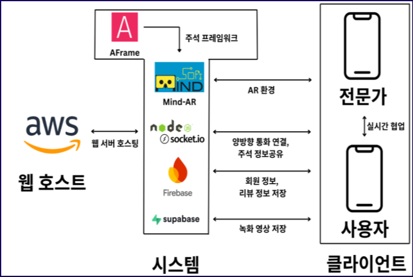

# AR 기반 원격 협업 시스템 구현
202055569 윤민혁 | 202055507 강유승 | 202055525 김준성

## 1. 프로젝트 배경
### 1.1. 국내외 시장 현황 및 문제점
> 컴퓨터 전공자가 아닌 일반인에게 컴퓨터 조립 과정은 상당한 어려움으로 다가올 수 있다.
> 설명서나 유튜브와 같은 영상, 혹은 지인과의 영상통화를 통한 도움을 받더라도
> 그들이 보유한 부품이나 케이스가 자료에서 다루는 제품과 일치하지 않아 맞춤형 설명을 받기가 어렵다.
> 이로 인해 자신의 상황에 꼭 맞는 조립 방법을 찾기 어렵고, 시행착오를 겪게 된다.

### 1.2. 필요성과 기대효과
> 사용자가 보유한 실제 부품과 케이스를 기반으로 한 맞춤형 안내가 필요하다.
> 만약 증강현실(AR) 주석을 통해 실시간으로 조립 절차를 안내받을 수 있다면,
> 사용자는 별도의 전문 지식 없이도 손쉽게 조립 과정을 따라갈 수 있으며,
> 결과적으로 컴퓨터 조립의 진입 장벽을 크게 낮출 수 있다.

### 1.3. 용어 정리
**게스트**
> 컴퓨터 조립에 대한 지식이 부족하여 도움을 요청하는 사용자.
> 실시간 상담을 요청할 수 있으며, 전문가가 입장 시 AR 화상 통화를 시작할 수 있다.

**전문가**
> 컴퓨터 조립에 능숙하여 게스트에게 도움을 주는 사용자.
> 상담 대기 중인 방에 입장이 가능하며, AR 주석을 추가하여 게스트에게 자세한 설명을 제공할 수 있다.

## 2. 개발 목표
### 2.1. 목표 및 세부 내용
> 본 연구는 AR(증강현실) 기술과 실시간 원격 통신 기술을 결합하여, 전문 지식이 없는 사용자도 PC 조립 및 부품 교체 과정에서 전문가의 실시간 지원을 직관적으로 받을 수 있는 원격 협업 시스템을 구현하는 것을 목표로 한다. 이를 통해 달성하고자 하는 세부 목표는 다음과 같다. 

>AR 기반의 직관적인 맞춤형 가이드 제공: 사용자의 실제 부품 위에 3D 객체나 디지털 주석을 증강하여, 복잡한 조립 과정을 시각적으로 이해하기 쉽게 안내할 수 있다. 
실시간 양방향 소통을 통한 문제 해결: WebRTC 기반의 화상 통화와 데이터 채널을 통해 사용자와 전문가가 원활하게 소통하며 조립 과정에서 발생하는 돌발 상황에 즉각적으로 대처할 수 있도록 지원한다. 
웹 기반 솔루션으로의 접근성 확보: 별도의 프로그램 설치 없이 웹 브라우저만으로 서비스에 접근하게 하여, 사용자의 편의성을 극대화하고 서비스 이용의 진입 장벽을 낮출 수 있다. 

### 2.2. 기존 서비스 대비 차별성 
#### 1. 웹 기반 접근성 (앱 설치 불필요)
>기존 서비스: TeamViewer Assist AR, Vuforia Chalk, SightCall 등은 주로 별도 앱 설치가 필요하거나 엔터프라이즈 환경에서 쓰이는 구조.

>ARSOL: Web AR(MindAR) + WebRTC 기반이라 브라우저만 있으면 바로 사용 가능. → 진입 장벽이 매우 낮음.

#### 2. 컴퓨터 조립에 특화된 AR 주석 & 3D 모델

>기존 서비스: 주로 산업 현장(설비 유지보수, 제조, 원격 기술 지원)에 초점. 특정 도메인(PC 조립)에 맞춘 3D 오브젝트 제공은 없음.

>ARSOL: CPU, RAM, GPU 등 PC 부품 전용 3D 모델과 주석 기능을 제공. → 사용자가 실제 보유한 부품 위에 직접 가이드 제공 가능.

#### 3. 맞춤형 전문가 매칭 & 리뷰 시스템

>기존 서비스: B2B 환경에 맞춰져 있어 전문가 리뷰/매칭 같은 개인화된 경험 제공 기능이 부족함.

>ARSOL: 전문가 리뷰/별점 시스템 포함 → 신뢰할 수 있는 전문가와 매칭 강화, 화상 통화 종료 후 자동 리뷰 작성 기능 → 사용자 경험과 품질 관리 가능.

#### 4. 세션 기록 및 복습 기능

>기존 서비스: 대부분 라이브 세션에 집중, 별도의 복습/학습 기능 제공은 제한적.

>ARSOL: MediaRecorder API + Supabase DB 연동 → 세션 영상 자동 저장 & 사용자가 다시 열람 가능 → 조립 과정 복습, 문제 재점검, 학습 용도로 재활용 가능.

#### 5. 전문가 주도형 방 생성 모델

>기존 서비스: 일반 화상회의/원격지원과 유사한 구조, 사용자가 세션 주도.

>ARSOL: 전문가가 방을 생성하고 사용자를 초대하는 ‘전문가 주도형 상담 모델’ 적용 → 서비스 흐름이 직관적이고 효율적임.

#### 6. 비용 구조 / 접근성

>기존 서비스: 엔터프라이즈 중심 → 높은 구독료, 기업 계약 기반.

>ARSOL: Firebase + Supabase 혼합 구조로 비용 절감. 웹 배포 기반이라 서버 관리 효율적 → 저비용, 개인 사용자 대상 서비스 제공 가능.

### 2.3. 사회적 가치 도입 계획 
#### 공공성 강화
>본 프로젝트는 컴퓨터 조립이나 부품 교체 과정에서 어려움을 겪는 일반 사용자가 전문가의 도움을 쉽고 직관적으로 받을 수 있도록 설계되었다. 이는 디지털 정보 격차(Digital Divide)를 줄이고, 비전문가·초보 사용자도 기술 혜택에 쉽게 접근할 수 있도록 하는 공공성을 지닌다. 특히 청소년, 고령자, 장애인 등 IT 기기 활용에 어려움이 있는 계층에게도 교육 및 지원 플랫폼으로 확장할 수 있다.

#### 지속 가능성 확보
>웹 기반(Web AR + WebRTC) 서비스 구조를 채택하여, 추가적인 설치나 고성능 장비 없이도 대부분의 디바이스에서 활용 가능하다. 이는 장기적으로 유지보수 비용을 절감하고, 누구나 쉽게 이용 가능한 형태로 서비스의 지속 가능성을 보장한다. 또한 Firebase·Supabase와 같은 클라우드 자원을 효율적으로 활용하여 서버 자원 낭비를 최소화한다.

#### 환경 보호 기여
>원격 AR 지원을 통해 사용자가 직접 서비스 센터나 수리점을 방문할 필요를 줄이고, 잘못된 조립으로 인한 전자 폐기물(E-Waste) 발생을 예방한다. 전문가의 실시간 지원으로 부품 손상 가능성을 줄여 자원의 낭비를 최소화하며, 장비 교체 대신 수리·재활용 문화를 장려할 수 있다. 이는 ICT 기반 서비스가 환경 보호에도 기여할 수 있음을 보여준다.

#### 지역 사회 및 교육적 확장
>프로젝트는 단순히 개인용 PC 조립 지원에 그치지 않고, 지역 학교·도서관·공공기관과 연계해 디지털 교육 플랫폼으로 발전할 수 있다. 예를 들어, 청소년 코딩/하드웨어 교육, 노년층 디지털 기기 활용 교육에서 AR 기반의 실시간 원격 지도를 활용하면 교육 효과를 높일 수 있다.
>즉, 우리 팀의 플랫폼은 단순한 기술 구현을 넘어 “누구나 쉽게 접근 가능한 디지털 공공 서비스”로 확장할 수 있고, 전자 폐기물 절감과 지속 가능성 측면에서도 사회적 가치를 창출한다는 점을 강조할 수 있다.
## 3. 시스템 설계
### 3.1. 시스템 구성도
</img>
### 3.2. 사용 기술
본 프로젝트는 웹 기반 AR 원격 협업 시스템으로, 프론트엔드와 백엔드, 데이터베이스 및 인프라를 포함한 다양한 최신 웹 기술 스택을 활용하였다.

#### 1) 프론트엔드 (Frontend)

##### React.js + Next.js
>컴포넌트 기반 UI 개발 및 SSR(Server Side Rendering) 지원
>next/dynamic을 활용하여 AR 모듈을 클라이언트 전용으로 렌더링

##### A-Frame + Three.js + MindAR.js
>A-Frame: WebXR 기반 3D 장면 구성
>Three.js: AR 주석 드로잉, 라인 렌더링 등 세밀한 3D 그래픽 처리
>MindAR.js: 마커 기반 이미지 트래킹 기능 제공 (PC 부품 인식/AR 오브젝트 배치)

##### Tailwind CSS
>반응형 UI 및 빠른 스타일링

#### 2) 백엔드 (Backend)
##### Node.js (Express 프레임워크)
>REST API 및 기본 서버 라우팅 처리
>시그널링 서버 환경 구축

##### Socket.IO
>WebRTC 연결 전 협상(Offer/Answer, ICE Candidate) 데이터 교환
>AR 주석 실시간 동기화(객체 생성, 삭제, 이동)

#### 3) 실시간 통신 (Real-Time Communication)

##### WebRTC
>브라우저 간 P2P 화상 통화 및 음성 전송
>데이터 채널(DataChannel)로 주석 이벤트 및 상호작용 정보 실시간 공유
>STUN/TURN 서버를 통한 NAT 우회 기능

#### 4) 데이터베이스 및 스토리지

##### Firebase (Authentication + Firestore)
>회원 정보 및 전문가 리뷰 데이터 저장
>비밀번호 해싱(bcrypt) 기반 인증 처리

##### Supabase (PostgreSQL 기반)
>세션 녹화 영상(webm 파일) 저장 및 관리
>무료 스토리지 기반으로 비용 절감

#### 5) 인프라 (Infrastructure)

##### AWS EC2
>서비스 배포용 가상 서버 인스턴스 운영

##### Nginx
>리버스 프록시 및 HTTPS 인증서 적용 (Let’s Encrypt)
>도메인 연결 및 보안 환경 제공

##### PM2
>Node.js 서버 프로세스 매니저 (자동 재시작, 로드 밸런싱, 로그 관리)

#### 6) API 및 보안

##### Next.js API Routes
>/api/rooms, /api/createRoom 등 RESTful API 제공

##### 암호화 및 보안
>WebRTC 자체 암호화(SRTP, DTLS) 기반 미디어 보안
>bcrypt 기반 비밀번호 해싱 저장

## 4. 개발 결과
### 4.1. 전체 시스템 흐름도
> 기능 흐름 설명 및 도식화 가능

### 4.2. 기능 설명 및 주요 기능 명세서
#### 회원가입 / 로그인 기능

입력: 사용자 닉네임, 비밀번호, 비밀번호 확인, 역할(사용자/전문가)

출력: 로그인 성공 여부(성공 시 세션 발급), 실패 시 오류 메시지

신규 사용자는 회원가입을 통해 계정을 생성할 수 있으며, 비밀번호는 bcrypt 해싱 후 DB(Firebase)에 저장된다. 로그인 시 입력한 정보와 DB 값을 비교해 인증을 수행한다.

#### 방 생성 / 참가 기능

입력: 방 ID, 방 이름, 비밀번호(선택), 생성자 닉네임

출력: 방 생성/참가 성공 여부, 현재 방 사용자 목록

전문가 계정은 새로운 상담 방을 개설할 수 있으며, 사용자는 초대 링크 또는 방 ID로 참여할 수 있다. Socket.IO 기반의 join 이벤트를 통해 실시간으로 참가자가 방에 연결된다.

#### 통화 연결 허용/거부 기능

입력: allow-call 요청 (Boolean)

출력: 통화 허용 시 WebRTC 연결 시작, 거부 시 강제 퇴장 처리

전문가가 방에 입장하면, 방장은 통화 허용 여부를 선택할 수 있다. 허용 시 연결이 진행되고, 거부 시 해당 전문가는 방에서 즉시 제거된다.

#### 화상 통화 기능

입력: 카메라/마이크 스트림, SDP Offer/Answer, ICE Candidate

출력: 상대방 영상·음성 스트림 표시

WebRTC 기반으로 브라우저 간 실시간 화상 통화를 지원한다. 시그널링 서버(Socket.IO)를 통해 초기 연결 협상을 진행하며, 이후 P2P 방식으로 미디어를 교환하여 지연 시간을 최소화한다.

#### AR 주석 추가 기능

입력: 클릭 좌표, 선택 도구(marker/text/3D 모델)

출력: 해당 위치에 증강 객체 생성 및 공유

MindAR.js 기반 이미지 인식 후, 사용자가 클릭한 위치에 3D 주석이나 텍스트, PC 부품 모델(CPU, RAM, GPU 등)을 배치한다. 주석 정보는 Socket.IO로 공유되어, 양쪽 화면에 동일하게 반영된다.

#### 전문가 상담 리뷰 / 열람 기능

입력: 리뷰 텍스트, 별점(1~5), roomId

출력: DB에 리뷰 저장, 사용자/전문가별 리뷰 목록 조회

세션 종료 후 사용자는 전문가에 대한 리뷰를 작성할 수 있으며, Firebase DB에 저장된다. 이후 본인 리뷰 열람(사용자), 자신을 평가한 리뷰 열람(전문가)이 가능하다.

#### 화면 녹화 및 열람 기능

입력: 녹화 시작/종료 명령, MediaStream

출력: webm 형식의 영상 파일(Supabase 저장), 녹화 영상 목록

MediaRecorder API로 화상 통화 및 AR 세션 화면을 녹화한다. 녹화된 영상은 Supabase DB에 webm 파일로 저장되며, 사용자는 본인이 녹화한 영상만 다시 확인할 수 있다.

### 4.3. 디렉토리 구조

### 4.4. 산업체 멘토링 의견 및 반영 사항
#### 녹화 및 복습 기능 강화

> 멘토 피드백:
> 원격 조립 과정은 단발성 지원에 그치지 않고, 사용자 학습 및 복습을 위한 아카이빙 기능이 필요하다는 의견을 받았다.

> 반영 사항:
> MediaRecorder API를 통해 세션 영상을 webm 형식으로 자동 저장하고, 사용자가 이후에 열람·복습할 수 있도록 기능을 구현하였다.

#### 서비스 확장성 및 다자간 협업 고려

> 멘토 피드백:
> 향후 다자간 협업(예: 교육 현장, 그룹 워크숍)으로 확장하려면 WebRTC P2P 구조의 한계(SFU/MCU 필요)를 고려해야 한다는 지적이 있었다.

> 반영 사항:
> 현재 시스템은 1:1 상담에 최적화되어 있음을 문서화하고, 추후 다자간 협업 시 미디어 서버(SFU/MCU) 도입이 필요하다는 아키텍처 가이드를 포함하였다.

#### UX/UI 개선

> 멘토 피드백:
> 실제 상담 시, 사용자는 자신의 화면보다 전문가 화면을 크게 보아야 가이드 효과가 크다는 의견이 있었다.

> 반영 사항:
> 원격 상담 페이지 레이아웃을 수정하여, 사용자의 카메라 화면보다 전문가 화면이 크게 표시되도록 UI를 재구성하였다.

## 5. 설치 및 실행 방법
> ## 도움을 받고 싶다면 "게스트", 도움을 주고 싶다면 "전문가"로 회원가입이 필수입니다
> ### [ARSOL 서비스 바로가기](https://ggg-ar-sol.org/)

### 5.1. 설치절차 및 실행 방법
> ### [ARSOL 서비스 바로가기](https://ggg-ar-sol.org/)

### 5.2. 오류 발생 시 해결 방법
본 프로젝트는 현재까지 치명적인 Known Issues는 발견되지 않았다.
다만, 일부 상황에서 다음과 같은 문제가 발생할 수 있으며, 이에 대한 해결 방법은 아래와 같다.

### 인터넷 속도가 느린 경우 화상 통화 지연 발생
> 원인: 네트워크 대역폭이 부족하거나 지연(latency)이 높은 환경에서 WebRTC 스트림 전송이 원활하지 않음.
#### 해결 방법:
> 가능한 안정적인 네트워크(유선 LAN, 고속 Wi-Fi 등)를 사용할 것

#### 뒤로가기 버튼 동작 불완전
> 원인: 브라우저의 히스토리 관리가 명확히 설정되지 않아 특정 상황에서 페이지 이동 오류 발생

## 6. 소개 자료 및 시연 영상
### 6.1. 프로젝트 소개 자료
> PPT 등
### 6.2. 시연 영상
> 영상 링크 또는 주요 장면 설명

## 7. 팀 구성
### 7.1. 팀원별 소개 및 역할 분담
| 이름    | 역할 분담            | 연락처         |
|:-------|:-------------------:|--------------:|
| 강유승  | DB 구축,통화 화면 녹화, 리뷰 시스템, AR 주석 기능 구현 | kys12103@gmail.com |
| 김준성  | AR 전환 기능, 이미지 인식, AR 주석 원격 생성 및 이동 | junsung010103@gmail.com |
| 윤민혁  | 상담 게시판 서버 구축, 화상 통화 환경 구축, 서비스 배포 | ghini7170@gmail.com |

### 7.2. 팀원 별 참여 후기
> #### 202055569 윤민혁
> 이번 프로젝트에서 상담 게시판 서버 구축, 화상 통화 환경(WebRTC) 구축, 서비스 배포를 담당하였다.
> Ubuntu 환경에서 Git 사용과 도메인 연결을 직접 경험하며 배포 과정을 익힐 수 있었고, Socket을 활용한 서버 동작 원리도 명확히 이해하게 되었다.
> 또한 WebRTC의 개념과 구현 과정을 체득하며 실시간 통신 기술에 대한 지식을 확장할 수 있었던 점이 유익한 경험이었다.
> #### 202055507 강유승
> 이번 프로젝트에서 DB 구축, AR 주석 모델링 및 선택 배치 기능, 화면 녹화 기능, 전문가 리뷰 시스템 기능을 담당하였다.
> Firebase DB, Supabase DB를 통해 회원 정보, 리뷰 정보, 녹화 영상 파일을 DB에 저장하고 관리하면서 DB를 통한 데이터 저장 및 관리에 대한 전반적인 구성과 매커니즘을 보다 명확히 이해할 수 있었다.
> 그리고 다소 생소하였던 AR을 통한 주석 배치 기능을 구현하면서 AR 환경의 동작 원리, 실시간 영상 통화를 통한 원격 주석 배치 시스템의 구현 방법을 자세히 습득할 수 있게 되는 계기가 되었다. 
> #### 202055525 김준성
> 이번 프로젝트에서 GitHub를 활용한 협업 방식을 익히고, 팀원들과 함께 문제를 해결하는 과정을 경험할 수 있었다.
> AR 영상과 카메라 화면을 합쳐 캡처한 뒤, 이를 상대방에게 실시간 스트림으로 전송하는 화면 공유 기술을 구현하며 웹 브라우저의 미디어 처리 방식에 대해 이해할 수 있었다.
> 원격 사용자가 클릭한 화면 좌표를 서버를 통해 전송받아 동일한 위치에 AR 주석을 생성하는 기능을 구현하며 데이터 통신과 원격 제어 기술에 대한 이해를 높였다.

### 8. 참고 문헌 및 출처
